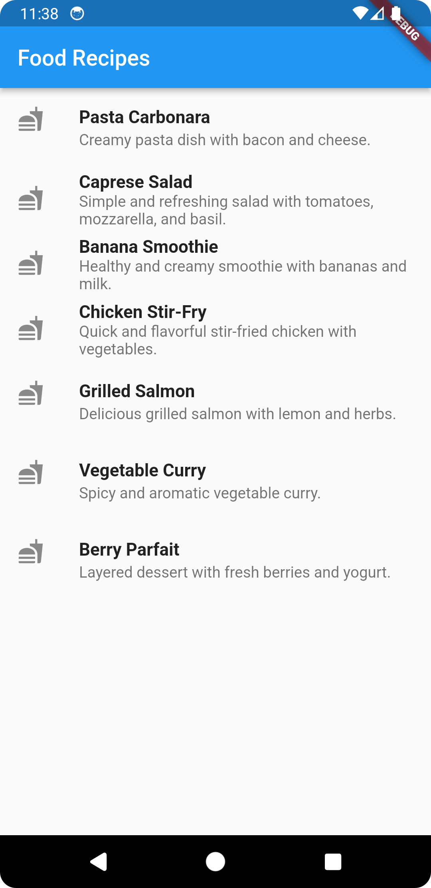

# module9_livetest

Parse the provided JSON containing a list of food recipes and display the recipe titles in a ListView widget in Flutter. Focus on JSON parsing, data modelling, and UI rendering.

 
